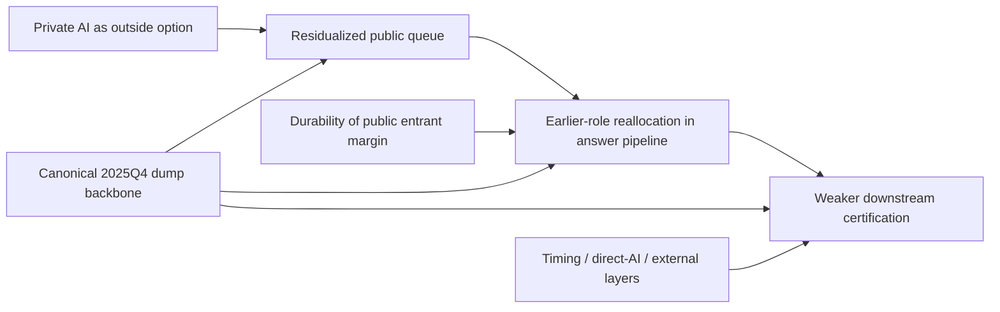

# Who Still Answers Option C: Anti-Bridge-Heavy Display Packet

Project title: `Private AI, Public Answer Work, and Certification at Stack Overflow`  
Purpose: align the main-text display architecture with the current manuscript spine  
Core logic: `residualized public queue -> answer-pipeline reallocation -> certification consequences`

## Display Rule

The main text should no longer teach the paper as `bridge -> role -> durability`.

The display packet should instead:

- lead with same-setting queue and role evidence
- move certification consequences after the mechanism stack is visible
- keep durability as bounded source-margin evidence
- keep timing and external/direct-AI layers as validation ladders
- keep conservative-inference and timing-discipline exhibits out of the story-leading slots

## Figure 1. Mechanism and Source Architecture

Use:

Caption:

`Figure 1 should teach the paper's mechanism stack before any single coefficient does. The article is about a residualized public queue, earlier-role reallocation inside the answer pipeline, and weaker downstream certification when accepted-current roles do not move with early roles. Durability and external/direct-AI evidence narrow interpretation but do not define the article's identity.`

## Figure 2. Residual Public Queue Recomposition

Status:

`Build needed from current question-level residualization and queue-composition outputs.`

Recommended contents:

- within-tag top-exposure-share decline
- within-tag average exposure-score decline
- `body_word_count_mean`
- `tag_count_full_mean`
- `residual_queue_complexity_index_mean`

Caption:

`Figure 2 should make the queue visible as a substantive same-setting family rather than late support prose. The goal is to show that the public problem set becomes less exposure-heavy and more context-heavy in the more exposed domains.`

## Figure 3. Answer-Pipeline Reallocation

Use:

Caption:

`Recent entrants become more visible in early and endorsed answer roles than in accepted-current certification. The safe interpretation is stage-specific answer-pipeline reallocation, not generic newcomer takeover.`

## Figure 4. Certification Consequences of Role Gaps

Use:

Caption:

`Larger early-versus-accepted role gaps are associated with weaker downstream certification. This is the paper's strongest empirical family, but it should be presented as a consequence test after the queue and role mechanism layers are already visible.`

## Figure 5. Durability of the Public Entrant Margin

Use:

Caption:

`Exposed domains exhibit weaker entrant durability and more one-shot participation after the transition. This is bounded source-margin evidence, not a coequal pillar.`

## Figure 6. Timing Triangulation

Use:

- 
- 

Caption:

`The timing layer should reinforce the same pipeline segment rather than imply a clean one-date shock. External AI salience and same-setting internal AI mentions both move with larger role gaps and weaker later certification.`

## Figure 7. Direct-AI-Use External Prototype

Use:

Caption:

`AIDev should remain a bounded external prototype showing that direct AI use can again split early visible response from later certification in a public technical setting. It is support, not identity.`

## Table 1. Sample and Core Design

Include:

- observation window `2020-01-01` to `2025-12-31`
- `16` focal tags
- `2,035,885` single-focal-tag questions
- `2,391,883` valid matched answers
- canonical source regime: `2025Q4` dump
- exposure measure: continuous pre-shock AI-substitutability score
- role outcomes: `first_answer`, `first_positive`, `top_score`, `accepted_current`

## Table 2. Core Role, Certification, and Source-Margin Estimates

Use the current manuscript rows in this order:

- `first_positive recent_entrant_90d_share`
- `top_score recent_entrant_90d_share`
- `recent_gap_first_vs_accepted -> accepted_vote_30d_rate`
- `recent_gap_first_vs_accepted -> first_positive_answer_latency_mean`
- `return_365d`
- `one_shot_365d`

## Table 3. Queue Recomposition Evidence

Use current question-level and tag-level queue results:

- top-exposure share decline
- within-tag average exposure-score decline
- `body_word_count_mean`
- `tag_count_full_mean`
- `residual_queue_complexity_index_mean`
- broad complexity composite

## Table 4. External Calibration and Direct-AI Sidecars

Use:

- JetBrains calibration
- DevGPT object-fit sidecar
- AIDev certification sidecar

## Table 5. Conservative Inference and Boundaries

Use:

- `who_still_answers_ws6_small_sample_inference.csv`
- timing-discipline outputs
- construct-sensitivity outputs

This table should carry:

- CR2
- wild bootstrap
- randomization inference where applicable
- explicit read column:
  - `main result`
  - `strongest consequence result`
  - `bounded support`
  - `secondary`

## Main-Text Sequence

The main text should now read in this order:

1. Figure 1 / Table 1
2. Figure 2 / Table 3
3. Figure 3 / Table 2
4. Figure 4
5. Figure 5
6. Figure 6
7. Figure 7 / Table 4
8. Table 5

## Main-Text Moves

- Do not let the bridge figure be the first substantive figure.
- Do not put conservative-inference visuals in story-leading slots.
- Do not use timing or external sidecars to carry the anti-bridge-heavy burden.
- If the queue figure is not ready, do not pretend the display architecture is finished.

## Reviewer-Memory Sentence

The packet should leave the reviewer with:

`Private AI residualizes the public queue, reallocates visible answer work toward earlier roles, and weakens downstream certification when accepted-current roles do not move with it.`
